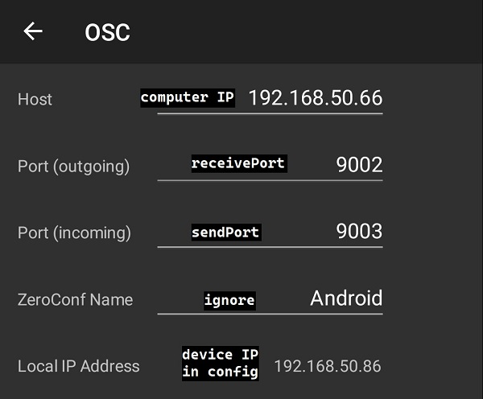

# TouchDCS

TouchDCS is an interface between OSC applications (in this case, TouchOSC) and DCS (using DCS-BIOS). It allows you to take custom-built OSC layouts, and use them to control your plane in DCS!

## Features

 - Build custom control panels to use on your phone or tablet (all major operating systems supported!)
 - Two-way communication with DCS-BIOS
 - Multi-device support

## Getting Started
### What you'll need:
1. DCS-BIOS ([Original](https://github.com/dcs-bios/dcs-bios) or [Flightpanels fork](https://github.com/DCSFlightpanels/dcs-bios))
2. [TouchOSC](https://hexler.net/products/touchosc) on your phone/tablet
    - editor recommended as well for creating custom layouts
    - at this time, TouchOSC is $5 on the Google Play store and I have no affiliation with the app or its creators
3. [.NET 5 **Runtime**](https://dotnet.microsoft.com/download/dotnet/5.0) (SDK/AspNetCore Runtimes not required)

### Download the latest version of TouchDCS
You can get the latest version [here](https://github.com/charliefoxtwo/TouchDCS/releases/latest). Unzip wherever you wish to run - no install required. I recommend unzipping into a folder just for TouchDCS, since it also requires a configuration file located in the same directory.
### Launch TouchDCS
When launching for the first time:
- a modal may pop up saying **Windows protected your PC**. Click _More info_, then click **Run anyway**. Don't worry, TouchDCS is guaranteed to be 99.9% virus free!
- you may see *another dialog* requesting network permissions. Click **Allow access** (99.9%, remember?)
- after granting all these permissions, you'll likely have to relaunch in order to actually be able to use your device with TouchDCS. Sorry about that :/
- TouchDCS will create a default config file for you, `config.json`, in the same folder as the TouchDCS exe. Open this up, we're going to edit it

### Configure TouchDCS to talk to your device
TouchDCS sends and receives commands from your device with TouchOSC installed. Open up the `config.json` file that TouchDCS created, and edit the settings under `osc` -> `endpoint` to match the settings you see in TouchOSC -> Settings -> OSC. You'll also need to add the IP address of the machine running TouchDCS to TouchOSC.
> Your default settings in TouchOSC will probably have the ports as 8000/9000 - that's fine. Just make sure they match in your config.json.

### Configure TouchDCS to talk to DCS-BIOS
Unless you have an abnormal configuration, you shouldn't have to do anything here. If your network configuration is different (e.g., DCS-BIOS is running elsewhere on the network and exporting to a non-default IP/port combination), you'll need to edit the settings under `dcsBios` -> `endpoint` to match your network configuration.
> The default configuration is set up for Open Beta. If you are on the release version of DCS and you are using the FlightPanels fork of DCS-BIOS, modify `dcsBios` -> `configLocations` to `%userprofile%/Saved Games/DCS/Scripts/DCS-BIOS/doc/json/`. The default config has multiple paths depending on the version you're using - but if you have multiple versions of DCS-BIOS or DCS installed, you may need to pick just one in your config file.

### Adding a layout
You can find out more about creating layouts and adding existing layouts [here](https://github.com/charliefoxtwo/TouchDCS/wiki/Layouts). Make sure to change your configuration path under `osc` -> `configLocations` to wherever you end up putting your *.json osc configuration files.

### That's it!
Now when you run TouchDCS, you should be good to go. Load up a mission and test your layout - when you press the sync button in the layout, the sync light should light up. If it doesn't, check the console to see if your aircraft has been identified. If not, there might be an issue with your DCS-BIOS setup; verify that's working property first. You might also try restarting both TouchOSC and TouchDCS. The applications don't have to be launched in any specific order, but the first run can be a bit funky.

# Going Further
### [Build your own layout](https://github.com/charliefoxtwo/TouchDCS/wiki/Layouts)
Using the TouchOSC Editor on your computer, you can create your own layouts.

### Found a bug?
Probably. This thing needs a lot of work. Open an issue in the Issues section and let's get it fixed.
